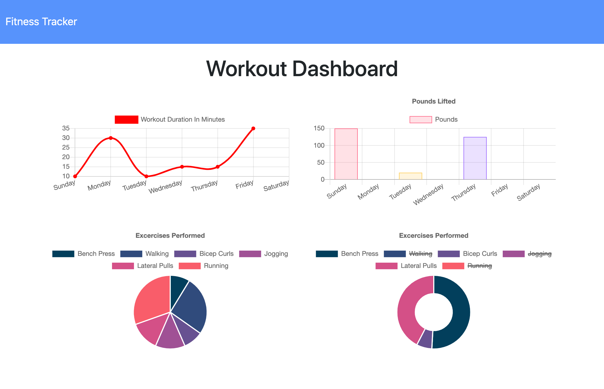

# Homework 17: Fitness Tracker (NoSQL)

## Description
This website application allows a user to create new workouts and add exercises to them. The data that the user inputs is then saved to a NoSQL database (MongoDB) where it can be displayed graphically on the dashboard page. 

## Deployed Application (Heroku)
<a href="https://lit-taiga-57650.herokuapp.com/">Fitness Tracker</a>

## Credits
* HTML
* CSS
* Javascript
* Node.js
* Express
* Compression
* MongoDB
* Mongoose
* Morgan
* Bootstrap
* Chart.js
* Heroku
* MongoDB Atlas

## Portfolio
<a href="https://kdoh52.github.io/">Updated portfolio</a>

## Contact
* kdoh52@gmail.com
